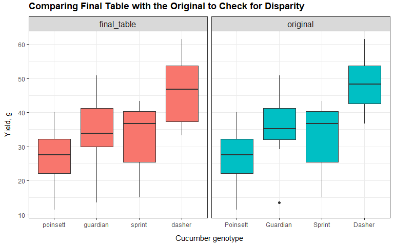

Dirty Data Cleaning and Transformation
================
Kar Ng
2021

-   [1 R PACKAGES](#1-r-packages)
-   [2 INTRODUCTION](#2-introduction)
-   [3 DATA IMPORT](#3-data-import)
-   [4 DATA CLEANING](#4-data-cleaning)
    -   [4.1 Cleaning table 1](#41-cleaning-table-1)
    -   [4.2 Cleaning table 2](#42-cleaning-table-2)
    -   [4.3 Cleaning tables 3 and 4](#43-cleaning-tables-3-and-4)
    -   [4.4 Combine all tables](#44-combine-all-tables)
    -   [4.5 Missing value Imputation](#45-missing-value-imputation)
-   [5. Data “health check”](#5-data-health-check)
-   [5 CONCLUSION](#5-conclusion)
-   [6 REFERENCE](#6-reference)

------------------------------------------------------------------------


------------------------------------------------------------------------

## 1 R PACKAGES

Following codes load required R packages for this project.

``` r
library(tidyverse)
library(skimr)
library(agridat)
library(caret)
```

## 2 INTRODUCTION

Data cleaning, manipulation and transformation are very important in
data science. They process datasets and convert them into a format that
is usable for later analysis such as visualisation and creating
predictive models.

This project is a side project to demonstrate my data cleaning skills.
This project works on a simple dataset with many common cleaning tasks.
I hope this project is comprehensive enough for your reference. You
could visit my other projects on my [Github](https://github.com/KAR-NG)
repository to view how I cleaned up other projects.

In this project, I will clean a public dataset from a R package -
“agridate”, the dataset is called “bridges.cucumber”. This dataset has
actually been cleaned but I downloaded the data, devastate, ruin and
mess it. The single cleaned table has been spitted into 4 tables with a
numbers of cleaning tasks.


How the original dataset is like?

``` r
data("bridges.cucumber", package = "agridat")
bridges.cucumber
```

    ##        loc      gen row col   yield
    ## 1  Clemson   Dasher   1   3 44.2000
    ## 2  Clemson   Dasher   2   4 54.1000
    ## 3  Clemson   Dasher   3   2 47.2000
    ## 4  Clemson   Dasher   4   1 36.7000
    ## 5  Clemson Guardian   1   4 33.0000
    ## 6  Clemson Guardian   2   2 13.6000
    ## 7  Clemson Guardian   3   1 44.1000
    ## 8  Clemson Guardian   4   3 35.8000
    ## 9  Clemson Poinsett   1   1 11.5000
    ## 10 Clemson Poinsett   2   3 22.4000
    ## 11 Clemson Poinsett   3   4 30.3000
    ## 12 Clemson Poinsett   4   2 21.5000
    ## 13 Clemson   Sprint   1   2 15.1000
    ## 14 Clemson   Sprint   2   1 20.3000
    ## 15 Clemson   Sprint   3   3 41.3000
    ## 16 Clemson   Sprint   4   4 27.1000
    ## 17  Tifton   Dasher   1   3 53.5463
    ## 18  Tifton   Dasher   2   4 37.5220
    ## 19  Tifton   Dasher   3   2 49.3943
    ## 20  Tifton   Dasher   4   1 61.4758
    ## 21  Tifton Guardian   1   4 34.7026
    ## 22  Tifton Guardian   2   2 29.1300
    ## 23  Tifton Guardian   3   1 40.2423
    ## 24  Tifton Guardian   4   3 50.7930
    ## 25  Tifton Poinsett   1   1 36.5749
    ## 26  Tifton Poinsett   2   3 24.6696
    ## 27  Tifton Poinsett   3   4 30.7489
    ## 28  Tifton Poinsett   4   2 40.0661
    ## 29  Tifton   Sprint   1   2 35.0771
    ## 30  Tifton   Sprint   2   1 43.3040
    ## 31  Tifton   Sprint   3   3 38.4251
    ## 32  Tifton   Sprint   4   4 39.9119

This dataset records the results of a cucumber experiment with variables
- loc (location), gen (genotype), row (row position of the trial block),
col (column position of the trial block) and lastly, the yield.

## 3 DATA IMPORT

Following codes import the 4 tables.

``` r
table1 <- read.csv("cucum1.csv", fileEncoding = "UTF-8-BOM")

table2 <- read.csv("cucum2.csv", fileEncoding = "UTF-8-BOM")

table3 <- read.csv("cucum3.csv", fileEncoding = "UTF-8-BOM")

table4 <- read.csv("cucum4.csv", fileEncoding = "UTF-8-BOM")
```

## 4 DATA CLEANING

In the upcoming cleanings of this project, you may see a more
complicated way to clean the data because this kind of procedures have
higher transferability between datasets or projects instead of just
relying on simple cleaning that only works in this project. My cleanings
will be a mix of both.

### 4.1 Cleaning table 1

Main tasks identified from table 1:


-   Rename the column names.  
-   Split the first column into two.  
-   Strings manipulation and extraction in the first column.  
-   Fill up the missing values of the first column.  
-   Convert the *4000* in the “row” into 4, according to adjacent values
    of this column.  
-   Convert the *1000* in the “column” into 1, according to adjacent
    values of this column.  
-   There are two observation with NAs in row, col and yield, these two
    rows should be removed as there are too many missing values that
    making these rows meaningless.
-   Imputation of two of the NA in the column “yield” by imputation
    model.

**Step 1： Cleaning column 1 by Rename + lower case + remove
punctuation**

``` r
t1 <- table1 %>% 
  rename("loc_gen" = Llocation.genotype,
         row = rowrow,
         col = column,
         yield = yield.g) %>% 
  mutate(loc_gen = str_to_lower(loc_gen),
         loc_gen = str_replace_all(loc_gen, "[[:punct:]]", " "),
         loc_gen = replace(loc_gen, loc_gen == " ", NA)) 

t1
```

    ##                               loc_gen  row  col yield
    ## 1                      clemson dasher    1    3  44.2
    ## 2                      clemson dasher    2    4  54.1
    ## 3                                <NA>    3    2    NA
    ## 4                      clemson dasher 4000    1  36.7
    ## 5                    clemson guardian    1    4  33.0
    ## 6                    clemson guardian    2    2  13.6
    ## 7                    clemson guardian    3    1  44.1
    ## 8                    clemson guardian    4    3    NA
    ## 9                   clem son poinsett    1 1000  11.5
    ## 10                   clemson poinsett    2    3  22.4
    ## 11                   clemson poinsett    3    4  30.3
    ## 12                   clemson poinsett    4    2  21.5
    ## 13                        clem sprint    1    2  15.1
    ## 14                     clemson sprint    2    1  20.3
    ## 15 i am pretty sure this is clemson s    3    3  41.3
    ## 16           clemson s   in this cell    4    4  27.1
    ## 17                     clemson sprint   NA   NA    NA
    ## 18                     clemson sprint   NA   NA    NA

**Step 2: Fill up the missing value in loc\_gen.**

I observed that the empty cell should be “clemson dasher” as compared to
adjacent strings and the frequency of this combination in the entire
dataset.

``` r
t1_temp <- t1 %>% 
  mutate(comment = ifelse(is.na(loc_gen), "Was a NA -->", ""),
         loc_gen = replace(loc_gen, is.na(loc_gen), "clemson dasher")) %>% 
  relocate(comment, .before = loc_gen)

t1_temp 
```

    ##         comment                            loc_gen  row  col yield
    ## 1                                   clemson dasher    1    3  44.2
    ## 2                                   clemson dasher    2    4  54.1
    ## 3  Was a NA -->                     clemson dasher    3    2    NA
    ## 4                                   clemson dasher 4000    1  36.7
    ## 5                                 clemson guardian    1    4  33.0
    ## 6                                 clemson guardian    2    2  13.6
    ## 7                                 clemson guardian    3    1  44.1
    ## 8                                 clemson guardian    4    3    NA
    ## 9                                clem son poinsett    1 1000  11.5
    ## 10                                clemson poinsett    2    3  22.4
    ## 11                                clemson poinsett    3    4  30.3
    ## 12                                clemson poinsett    4    2  21.5
    ## 13                                     clem sprint    1    2  15.1
    ## 14                                  clemson sprint    2    1  20.3
    ## 15              i am pretty sure this is clemson s    3    3  41.3
    ## 16                        clemson s   in this cell    4    4  27.1
    ## 17                                  clemson sprint   NA   NA    NA
    ## 18                                  clemson sprint   NA   NA    NA

**Step 3: Create loc and gen from log\_gen**

``` r
# set up df

t1 <- t1_temp %>% dplyr::select(-comment)

# set up rules

loc <- "clemson|clem|c"          # Observe from table 1 I know that loc is clemson
gen <- c("dasher|guardian|poinsett|sprint") # Observe from table 1 I know these are gen 

# get loc and gen, and remove loc_gen 

t1 <- t1 %>% 
  mutate(loc = str_extract(loc_gen, loc),
         gen = str_extract(loc_gen, gen),
         gen = ifelse(loc_gen == "i am pretty sure this is clemson s", "sprint", gen)) %>% 
  mutate(gen = ifelse(str_detect(loc_gen,"in this cell"), "sprint", gen)) %>% 
  dplyr::select(-loc_gen) %>% 
  relocate(loc, .before = row) %>% 
  relocate(gen, .after = loc) %>% 
  mutate(loc = ifelse(loc == "clem", "clemson", loc)) %>% 
  mutate_if(is.character, as.factor)
  
t1 
```

    ##        loc      gen  row  col yield
    ## 1  clemson   dasher    1    3  44.2
    ## 2  clemson   dasher    2    4  54.1
    ## 3  clemson   dasher    3    2    NA
    ## 4  clemson   dasher 4000    1  36.7
    ## 5  clemson guardian    1    4  33.0
    ## 6  clemson guardian    2    2  13.6
    ## 7  clemson guardian    3    1  44.1
    ## 8  clemson guardian    4    3    NA
    ## 9  clemson poinsett    1 1000  11.5
    ## 10 clemson poinsett    2    3  22.4
    ## 11 clemson poinsett    3    4  30.3
    ## 12 clemson poinsett    4    2  21.5
    ## 13 clemson   sprint    1    2  15.1
    ## 14 clemson   sprint    2    1  20.3
    ## 15 clemson   sprint    3    3  41.3
    ## 16 clemson   sprint    4    4  27.1
    ## 17 clemson   sprint   NA   NA    NA
    ## 18 clemson   sprint   NA   NA    NA

In table 1, the “loc” has only 1 level called “clemson”.

``` r
levels(t1$loc)
```

    ## [1] "clemson"

In table 1, the “gen” has 4 levels.

``` r
levels(t1$gen)
```

    ## [1] "dasher"   "guardian" "poinsett" "sprint"

**Step 4: Get perfect loc and gen column.**

Calculating the number of missing values in each row of data, not
column.

-   Row 17 and 18 have the highest number of missing values.
-   They will be removed.

``` r
 t1 %>% 
  mutate(id = row_number()) %>% 
  gather(key = "variable", value = "value", -6) %>% 
  mutate(max.number.of.variables = n_distinct(variable)) %>% 
  filter(is.na(value)) %>% 
  group_by(id, max.number.of.variables) %>% 
  summarise(count = n()) %>% 
  mutate(InfoLost.percent = paste0(count/max.number.of.variables * 100, "%"))
```

    ## Warning: attributes are not identical across measure variables;
    ## they will be dropped

    ## `summarise()` has grouped output by 'id'. You can override using the `.groups` argument.

    ## # A tibble: 4 x 4
    ## # Groups:   id [4]
    ##      id max.number.of.variables count InfoLost.percent
    ##   <int>                   <int> <int> <chr>           
    ## 1     3                       5     1 20%             
    ## 2     8                       5     1 20%             
    ## 3    17                       5     3 60%             
    ## 4    18                       5     3 60%

Checking row 17 and 18, they do not contain important information.

``` r
t1[c(17:18), ]
```

    ##        loc    gen row col yield
    ## 17 clemson sprint  NA  NA    NA
    ## 18 clemson sprint  NA  NA    NA

Additionally, all level have 4 levels and only sprint has 6 levels. It
is obvious that 17 and 18 are errors and should be removed.

``` r
t1 %>% group_by(gen) %>% summarise(count = n())
```

    ## # A tibble: 4 x 2
    ##   gen      count
    ##   <fct>    <int>
    ## 1 dasher       4
    ## 2 guardian     4
    ## 3 poinsett     4
    ## 4 sprint       6

Removing row 17 and 18.

``` r
t1 <- t1[-c(17, 18),]
```

Removal was succesful.

``` r
t1 %>% group_by(gen) %>% summarise(count = n())
```

    ## # A tibble: 4 x 2
    ##   gen      count
    ##   <fct>    <int>
    ## 1 dasher       4
    ## 2 guardian     4
    ## 3 poinsett     4
    ## 4 sprint       4

Next, I will clean up the 4000 and 1000 in the “row” and “col” columns.

**Step 5: Cleaning outlier values in row and col**

``` r
table1 <- t1 %>% 
  mutate(row = replace(row, row == 4000, 4),
         col = replace(col, col == 1000, 1))
  
summary(table1)
```

    ##       loc           gen         row            col           yield      
    ##  clemson:16   dasher  :4   Min.   :1.00   Min.   :1.00   Min.   :11.50  
    ##               guardian:4   1st Qu.:1.75   1st Qu.:1.75   1st Qu.:20.60  
    ##               poinsett:4   Median :2.50   Median :2.50   Median :28.70  
    ##               sprint  :4   Mean   :2.50   Mean   :2.50   Mean   :29.66  
    ##                            3rd Qu.:3.25   3rd Qu.:3.25   3rd Qu.:40.15  
    ##                            Max.   :4.00   Max.   :4.00   Max.   :54.10  
    ##                                                          NA's   :2

The cleaning of table 1 has now considered completed. There are two
missing values in the *yield*, I will fill them up with imputation model
after combining other tables into this table.

### 4.2 Cleaning table 2

Main tasks identified:


-   Trim leading and trailing white spaces.  
-   Remove the first column.  
-   Rename column names.  
-   Clean the strings in location and genotype.
-   Combine yield\_x, yield\_y, and yield\_z

**Structural and variable names conversion**

``` r
tbl2 <- table2 %>% 
  rename(loc = Llocation,             # Change variable names
         gen = genotype,
         row = rowrow,
         col = colu....mn) %>% 
  select(-X) %>%                      # remove first column
  mutate(loc = trimws(loc),           # trim leading and trailing white spaces 
         gen = trimws(gen)) %>% 
  mutate_if(is.character, as.factor)  # changing character variables to factor


summary(tbl2)
```

    ##         loc              gen         row             col           yield.x     
    ##  t        :1               :2   Min.   :1.000   Min.   :1.000   Min.   :34.70  
    ##  T        :2   Dasher      :4   1st Qu.:1.250   1st Qu.:1.250   1st Qu.:37.52  
    ##  Ti   fton:1   Guardian    :3   Median :2.000   Median :2.000   Median :49.39  
    ##  Tif      :1   Poi    nsett:1   Mean   :2.357   Mean   :2.357   Mean   :47.33  
    ##  Tiftaaon :1   Poinsett    :2   3rd Qu.:3.000   3rd Qu.:3.000   3rd Qu.:53.55  
    ##  Tifton   :8   Sprint      :2   Max.   :4.000   Max.   :4.000   Max.   :61.48  
    ##                                                                 NA's   :9      
    ##     yield_y         yield_z     
    ##  Min.   :24.67   Min.   :30.75  
    ##  1st Qu.:29.13   1st Qu.:34.00  
    ##  Median :36.57   Median :37.57  
    ##  Mean   :36.28   Mean   :37.30  
    ##  3rd Qu.:40.24   3rd Qu.:40.88  
    ##  Max.   :50.79   Max.   :43.30  
    ##  NA's   :9       NA's   :10

In the column “loc”, all values are actually “Tifton” based on the
original dataset, and it is my job to convert all other strings into
“Tifton”. In the column “gen”, I will need to rectify a typo of Poinsett
and fill up 2 blank cells.

**Cleaning the strings**

``` r
tbl2 <- tbl2 %>% 
  mutate_if(is.factor, as.character) %>% 
  mutate(loc = case_when(loc == "t" ~ "Tifton",
                         loc == "T" ~ "Tifton",
                         loc == "Ti   fton" ~ "Tifton",
                         loc == "Tif" ~ "Tifton",
                         TRUE ~ loc),
         loc = replace(loc, loc == "Tiftaaon", "Tifton"),
         gen = replace(gen, gen == "Poi    nsett", "Poinsett"),
         gen = replace(gen, gen == "", NA)) %>% 
  fill(gen) %>%                               
  mutate_if(is.character, as.factor)


summary(tbl2)
```

    ##      loc           gen         row             col           yield.x     
    ##  Tifton:14   Dasher  :4   Min.   :1.000   Min.   :1.000   Min.   :34.70  
    ##              Guardian:4   1st Qu.:1.250   1st Qu.:1.250   1st Qu.:37.52  
    ##              Poinsett:4   Median :2.000   Median :2.000   Median :49.39  
    ##              Sprint  :2   Mean   :2.357   Mean   :2.357   Mean   :47.33  
    ##                           3rd Qu.:3.000   3rd Qu.:3.000   3rd Qu.:53.55  
    ##                           Max.   :4.000   Max.   :4.000   Max.   :61.48  
    ##                                                           NA's   :9      
    ##     yield_y         yield_z     
    ##  Min.   :24.67   Min.   :30.75  
    ##  1st Qu.:29.13   1st Qu.:34.00  
    ##  Median :36.57   Median :37.57  
    ##  Mean   :36.28   Mean   :37.30  
    ##  3rd Qu.:40.24   3rd Qu.:40.88  
    ##  Max.   :50.79   Max.   :43.30  
    ##  NA's   :9       NA's   :10

Next I will need to combine yield x, y, and z into 1 single column with
a name, “yield”.

**Combine the column yield x, y and z**

``` r
table2 <- tbl2 %>%
  mutate(yield = paste0(yield.x, yield_y, yield_z)) %>% 
  mutate(yield = str_remove_all(yield, pattern = "NA")) %>% 
  select(-5, -6, -7)

table2
```

    ##       loc      gen row col   yield
    ## 1  Tifton   Dasher   1   3 53.5463
    ## 2  Tifton   Dasher   2   4  37.522
    ## 3  Tifton   Dasher   3   2 49.3943
    ## 4  Tifton   Dasher   4   1 61.4758
    ## 5  Tifton Guardian   1   4 34.7026
    ## 6  Tifton Guardian   2   2   29.13
    ## 7  Tifton Guardian   3   1 40.2423
    ## 8  Tifton Guardian   4   3  50.793
    ## 9  Tifton Poinsett   1   1 36.5749
    ## 10 Tifton Poinsett   2   3 24.6696
    ## 11 Tifton Poinsett   3   4 30.7489
    ## 12 Tifton Poinsett   4   2 40.0661
    ## 13 Tifton   Sprint   1   2 35.0771
    ## 14 Tifton   Sprint   2   1  43.304

The cleaning of table 2 has now completed.

### 4.3 Cleaning tables 3 and 4

This section will clean 3 and 4 together and combine them into 1.

Main tasks identified:


-   Merge 2 tables together.  
-   Rename variable names.  
-   Remove the irrelevant row 3 (id = 3).  
-   Fix the typo “10” in the column of ROW in table 4.
-   Convert the levels of location and genotype into a proper case with
    only the first character being upper case.

``` r
table3 <- table3 %>% 
  left_join(table4, by = "id") %>% 
  select(-1) %>% 
  rename(loc = LOCATION,
         gen = GENOTYPE,
         row = ROW,
         col = COLUMN,
         yield = YIELD.G) %>% 
  mutate(loc = replace(loc, loc == "TIFTON", "Tifton"),
         gen = replace(gen, gen == "SPRINT", "Sprint")) %>% 
  filter(loc != "GATTON")
```

The cleaning of tables 3 and 4 has now completed.

### 4.4 Combine all tables

Finally, 3 tables are combined into one final table.

``` r
final_table <- rbind(table1, table2, table3)

final_table <- final_table %>% 
  mutate(yield = as.double(yield))

# a bit of cleaning

final_table <- final_table %>% 
  mutate(loc = str_to_lower(loc),
         gen = str_to_lower(gen)) %>% 
  mutate_if(is.character, as.factor) %>% 
  arrange(loc, gen, row, col)

final_table
```

    ##        loc      gen row col   yield
    ## 1  clemson   dasher   1   3 44.2000
    ## 2  clemson   dasher   2   4 54.1000
    ## 3  clemson   dasher   3   2      NA
    ## 4  clemson   dasher   4   1 36.7000
    ## 5  clemson guardian   1   4 33.0000
    ## 6  clemson guardian   2   2 13.6000
    ## 7  clemson guardian   3   1 44.1000
    ## 8  clemson guardian   4   3      NA
    ## 9  clemson poinsett   1   1 11.5000
    ## 10 clemson poinsett   2   3 22.4000
    ## 11 clemson poinsett   3   4 30.3000
    ## 12 clemson poinsett   4   2 21.5000
    ## 13 clemson   sprint   1   2 15.1000
    ## 14 clemson   sprint   2   1 20.3000
    ## 15 clemson   sprint   3   3 41.3000
    ## 16 clemson   sprint   4   4 27.1000
    ## 17  tifton   dasher   1   3 53.5463
    ## 18  tifton   dasher   2   4 37.5220
    ## 19  tifton   dasher   3   2 49.3943
    ## 20  tifton   dasher   4   1 61.4758
    ## 21  tifton guardian   1   4 34.7026
    ## 22  tifton guardian   2   2 29.1300
    ## 23  tifton guardian   3   1 40.2423
    ## 24  tifton guardian   4   3 50.7930
    ## 25  tifton poinsett   1   1 36.5749
    ## 26  tifton poinsett   2   3 24.6696
    ## 27  tifton poinsett   3   4 30.7489
    ## 28  tifton poinsett   4   2 40.0661
    ## 29  tifton   sprint   1   2 35.0771
    ## 30  tifton   sprint   2   1 43.3040
    ## 31  tifton   sprint   3   3 38.4251
    ## 32  tifton   sprint   4   4 39.9119

### 4.5 Missing value Imputation

Last but not least, there are 2 missing values in the “yield” column and
I will fill them up using imputation model to predict the most possible
values based on adjacent data.

``` r
colSums(is.na(final_table))
```

    ##   loc   gen   row   col yield 
    ##     0     0     0     0     2

Imputation technique I am applying is a type of machine learning
imputation model that will use all columns in the dataset to predict
these missing values. I am using the imputation function from “caret”
package.

To use the function, I will need to convert all factor variables into
dummy data.

``` r
# Dummy transformation

dummy.variables <- dummyVars(~., data = final_table)
final_table_dum <- dummy.variables %>% predict(final_table)  

head(final_table_dum)
```

    ##   loc.clemson loc.tifton gen.dasher gen.guardian gen.poinsett gen.sprint row
    ## 1           1          0          1            0            0          0   1
    ## 2           1          0          1            0            0          0   2
    ## 3           1          0          1            0            0          0   3
    ## 4           1          0          1            0            0          0   4
    ## 5           1          0          0            1            0          0   1
    ## 6           1          0          0            1            0          0   2
    ##   col yield
    ## 1   3  44.2
    ## 2   4  54.1
    ## 3   2    NA
    ## 4   1  36.7
    ## 5   4  33.0
    ## 6   2  13.6

Assessing the number of missing values again.

``` r
colSums(is.na(final_table_dum))
```

    ##  loc.clemson   loc.tifton   gen.dasher gen.guardian gen.poinsett   gen.sprint 
    ##            0            0            0            0            0            0 
    ##          row          col        yield 
    ##            0            0            2

Imputation using bagging of decision trees.

``` r
set.seed(123)

imputation.model <- preProcess(final_table_dum, method = "bagImpute")
imputed.final.table <- imputation.model %>% predict(final_table_dum)
imputed.final.table
```

    ##    loc.clemson loc.tifton gen.dasher gen.guardian gen.poinsett gen.sprint row
    ## 1            1          0          1            0            0          0   1
    ## 2            1          0          1            0            0          0   2
    ## 3            1          0          1            0            0          0   3
    ## 4            1          0          1            0            0          0   4
    ## 5            1          0          0            1            0          0   1
    ## 6            1          0          0            1            0          0   2
    ## 7            1          0          0            1            0          0   3
    ## 8            1          0          0            1            0          0   4
    ## 9            1          0          0            0            1          0   1
    ## 10           1          0          0            0            1          0   2
    ## 11           1          0          0            0            1          0   3
    ## 12           1          0          0            0            1          0   4
    ## 13           1          0          0            0            0          1   1
    ## 14           1          0          0            0            0          1   2
    ## 15           1          0          0            0            0          1   3
    ## 16           1          0          0            0            0          1   4
    ## 17           0          1          1            0            0          0   1
    ## 18           0          1          1            0            0          0   2
    ## 19           0          1          1            0            0          0   3
    ## 20           0          1          1            0            0          0   4
    ## 21           0          1          0            1            0          0   1
    ## 22           0          1          0            1            0          0   2
    ## 23           0          1          0            1            0          0   3
    ## 24           0          1          0            1            0          0   4
    ## 25           0          1          0            0            1          0   1
    ## 26           0          1          0            0            1          0   2
    ## 27           0          1          0            0            1          0   3
    ## 28           0          1          0            0            1          0   4
    ## 29           0          1          0            0            0          1   1
    ## 30           0          1          0            0            0          1   2
    ## 31           0          1          0            0            0          1   3
    ## 32           0          1          0            0            0          1   4
    ##    col    yield
    ## 1    3 44.20000
    ## 2    4 54.10000
    ## 3    2 33.28960
    ## 4    1 36.70000
    ## 5    4 33.00000
    ## 6    2 13.60000
    ## 7    1 44.10000
    ## 8    3 30.28232
    ## 9    1 11.50000
    ## 10   3 22.40000
    ## 11   4 30.30000
    ## 12   2 21.50000
    ## 13   2 15.10000
    ## 14   1 20.30000
    ## 15   3 41.30000
    ## 16   4 27.10000
    ## 17   3 53.54630
    ## 18   4 37.52200
    ## 19   2 49.39430
    ## 20   1 61.47580
    ## 21   4 34.70260
    ## 22   2 29.13000
    ## 23   1 40.24230
    ## 24   3 50.79300
    ## 25   1 36.57490
    ## 26   3 24.66960
    ## 27   4 30.74890
    ## 28   2 40.06610
    ## 29   2 35.07710
    ## 30   1 43.30400
    ## 31   3 38.42510
    ## 32   4 39.91190

Overwrite the “yield” of the final\_table.

``` r
final_table$yield <- imputed.final.table[, 9]
```

Checking randomly selected 10 rows from the dataset. The imputation has
been successful.

``` r
sample_n(final_table, 10)
```

    ##        loc      gen row col    yield
    ## 1  clemson   sprint   2   1 20.30000
    ## 2  clemson guardian   4   3 30.28232
    ## 3  clemson guardian   3   1 44.10000
    ## 4  clemson   dasher   3   2 33.28960
    ## 5   tifton poinsett   3   4 30.74890
    ## 6  clemson   sprint   1   2 15.10000
    ## 7   tifton poinsett   1   1 36.57490
    ## 8   tifton   sprint   4   4 39.91190
    ## 9   tifton poinsett   4   2 40.06610
    ## 10  tifton guardian   1   4 34.70260

## 5. Data “health check”

There are no missing values in the dataset by examining the variables
“n\_missing” and “complete\_rate” of following table.

``` r
skim_without_charts(final_table)
```

|                                                  |              |
|:-------------------------------------------------|:-------------|
| Name                                             | final\_table |
| Number of rows                                   | 32           |
| Number of columns                                | 5            |
| \_\_\_\_\_\_\_\_\_\_\_\_\_\_\_\_\_\_\_\_\_\_\_   |              |
| Column type frequency:                           |              |
| factor                                           | 2            |
| numeric                                          | 3            |
| \_\_\_\_\_\_\_\_\_\_\_\_\_\_\_\_\_\_\_\_\_\_\_\_ |              |
| Group variables                                  | None         |

Data summary

**Variable type: factor**

| skim\_variable | n\_missing | complete\_rate | ordered | n\_unique | top\_counts                    |
|:---------------|-----------:|---------------:|:--------|----------:|:-------------------------------|
| loc            |          0 |              1 | FALSE   |         2 | cle: 16, tif: 16               |
| gen            |          0 |              1 | FALSE   |         4 | das: 8, gua: 8, poi: 8, spr: 8 |

**Variable type: numeric**

| skim\_variable | n\_missing | complete\_rate |  mean |    sd |   p0 |   p25 |   p50 |   p75 |  p100 |
|:---------------|-----------:|---------------:|------:|------:|-----:|------:|------:|------:|------:|
| row            |          0 |              1 |  2.50 |  1.14 |  1.0 |  1.75 |  2.50 |  3.25 |  4.00 |
| col            |          0 |              1 |  2.50 |  1.14 |  1.0 |  1.75 |  2.50 |  3.25 |  4.00 |
| yield          |          0 |              1 | 35.14 | 12.02 | 11.5 | 28.62 | 35.83 | 41.80 | 61.48 |

All data are with correct type that are readied for machine learning
prediction.

``` r
glimpse(final_table)
```

    ## Rows: 32
    ## Columns: 5
    ## $ loc   <fct> clemson, clemson, clemson, clemson, clemson, clemson, clemson, c~
    ## $ gen   <fct> dasher, dasher, dasher, dasher, guardian, guardian, guardian, gu~
    ## $ row   <dbl> 1, 2, 3, 4, 1, 2, 3, 4, 1, 2, 3, 4, 1, 2, 3, 4, 1, 2, 3, 4, 1, 2~
    ## $ col   <dbl> 3, 4, 2, 1, 4, 2, 1, 3, 1, 3, 4, 2, 2, 1, 3, 4, 3, 4, 2, 1, 4, 2~
    ## $ yield <dbl> 44.20000, 54.10000, 33.28960, 36.70000, 33.00000, 13.60000, 44.1~

I can clearly see that there are two location “Clemson” and “Tifton” as
well as 4 cucumber genotypes represented by “gen”. Both variables have
equal sample sizes among their attribute (or known as “level”).

``` r
summary(final_table)
```

    ##       loc           gen         row            col           yield      
    ##  clemson:16   dasher  :8   Min.   :1.00   Min.   :1.00   Min.   :11.50  
    ##  tifton :16   guardian:8   1st Qu.:1.75   1st Qu.:1.75   1st Qu.:28.62  
    ##               poinsett:8   Median :2.50   Median :2.50   Median :35.83  
    ##               sprint  :8   Mean   :2.50   Mean   :2.50   Mean   :35.14  
    ##                            3rd Qu.:3.25   3rd Qu.:3.25   3rd Qu.:41.80  
    ##                            Max.   :4.00   Max.   :4.00   Max.   :61.48

This project is not meant to draw graphs but I am drawing one to inspect
and compare my final cleaned table with the original dataset from the R
package, named “bridges.cucumber”.

``` r
# Set up dataframe / combine final table with the original dataset

group <- rep(c("final_table", "original"), each = 32)
test <- rbind(final_table, bridges.cucumber)
test <- cbind(group, test)

# Plot

ggplot(test, aes(x = fct_reorder(gen, yield), y = yield, fill = group)) +
  geom_boxplot() +
  facet_wrap(~ group, scales = "free_x") +
  theme_bw() +
  theme(legend.position = "none",
        strip.text = element_text(size = 12),
        axis.title.x = element_text(margin = margin(10, 0, 0, 0)),
        axis.title.y = element_text(margin = margin(0, 10, 0, 0)),
        plot.title = element_text(face = "bold", vjust = 2)) +
  labs(x = "Cucumber genotype",
       y = "Yield, g",
       title = "Comparing Final Table with the Original to Check for Disparity")
```

<!-- -->

There were two missing values in guardian and dasher of final\_table
filled up by estimates from the imputation model. That is why the
guardian and dasher of two dataset seems a little bit different.
However, the difference is minor and not dramatic.

## 5 CONCLUSION

In conclusion, this project successfully uses R codes to clean and
combine four messy tables into one that has a perfect format for
analysis.

*Thank you for reading.*

## 6 REFERENCE

<https://cran.r-project.org/web/packages/agridat/agridat.pdf>
