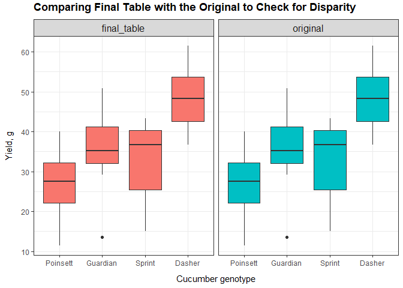

Dirty Data Cleaning and Transformation
================
Kar Ng
2021

-   [1 R PACKAGES](#1-r-packages)
-   [2 INTRODUCTION](#2-introduction)
-   [3 DATA IMPORT](#3-data-import)
-   [4 DATA CLEANING](#4-data-cleaning)
    -   [4.1 Cleaning table 1](#41-cleaning-table-1)
    -   [4.2 Cleaning table 2](#42-cleaning-table-2)
    -   [4.3 Cleaning tables 3 and 4](#43-cleaning-tables-3-and-4)
    -   [4.4 Combine all tables](#44-combine-all-tables)
-   [5 CONCLUSION](#5-conclusion)
-   [6 REFERENCE](#6-reference)

------------------------------------------------------------------------


------------------------------------------------------------------------

## 1 R PACKAGES

Following codes load required R packages for this project.

``` r
library(tidyverse)
library(skimr)
library(agridat)
```

## 2 INTRODUCTION

Data cleaning, manipulation and transformation are very important in
data science. They process datasets and convert them into a format that
is usable for later analysis such as visualisation and creating
predictive models.

This project is a side project to demonstrate my data cleaning skills. I
hope this project is comprehensive enough for your reference. You could
visit my other projects on my [Github](https://github.com/KAR-NG)
repository to view how I cleaned up data for many other projects. All my
projects have a section of data cleaning.

In this project, I will clean a public dataset from a R package -
“agridate”, the dataset is called “bridges.cucumber”. This dataset has
actually been cleaned but I downloaded the data, devastate, ruin and
mess it. The single cleaned table has been spitted into 4 tables with a
numbers of cleaning tasks.


How the original dataset is like?

``` r
data("bridges.cucumber", package = "agridat")
bridges.cucumber
```

    ##        loc      gen row col   yield
    ## 1  Clemson   Dasher   1   3 44.2000
    ## 2  Clemson   Dasher   2   4 54.1000
    ## 3  Clemson   Dasher   3   2 47.2000
    ## 4  Clemson   Dasher   4   1 36.7000
    ## 5  Clemson Guardian   1   4 33.0000
    ## 6  Clemson Guardian   2   2 13.6000
    ## 7  Clemson Guardian   3   1 44.1000
    ## 8  Clemson Guardian   4   3 35.8000
    ## 9  Clemson Poinsett   1   1 11.5000
    ## 10 Clemson Poinsett   2   3 22.4000
    ## 11 Clemson Poinsett   3   4 30.3000
    ## 12 Clemson Poinsett   4   2 21.5000
    ## 13 Clemson   Sprint   1   2 15.1000
    ## 14 Clemson   Sprint   2   1 20.3000
    ## 15 Clemson   Sprint   3   3 41.3000
    ## 16 Clemson   Sprint   4   4 27.1000
    ## 17  Tifton   Dasher   1   3 53.5463
    ## 18  Tifton   Dasher   2   4 37.5220
    ## 19  Tifton   Dasher   3   2 49.3943
    ## 20  Tifton   Dasher   4   1 61.4758
    ## 21  Tifton Guardian   1   4 34.7026
    ## 22  Tifton Guardian   2   2 29.1300
    ## 23  Tifton Guardian   3   1 40.2423
    ## 24  Tifton Guardian   4   3 50.7930
    ## 25  Tifton Poinsett   1   1 36.5749
    ## 26  Tifton Poinsett   2   3 24.6696
    ## 27  Tifton Poinsett   3   4 30.7489
    ## 28  Tifton Poinsett   4   2 40.0661
    ## 29  Tifton   Sprint   1   2 35.0771
    ## 30  Tifton   Sprint   2   1 43.3040
    ## 31  Tifton   Sprint   3   3 38.4251
    ## 32  Tifton   Sprint   4   4 39.9119

This dataset records the results of a cucumber experiment with variables
- loc (location), gen (genotype), row (row position of the trial block),
col (column position of the trial block) and lastly, the yield.

## 3 DATA IMPORT

Following codes import the 4 tables.

``` r
table1 <- read.csv("cucum1.csv", fileEncoding = "UTF-8-BOM")

table2 <- read.csv("cucum2.csv", fileEncoding = "UTF-8-BOM")

table3 <- read.csv("cucum3.csv", fileEncoding = "UTF-8-BOM")

table4 <- read.csv("cucum4.csv", fileEncoding = "UTF-8-BOM")
```

## 4 DATA CLEANING

### 4.1 Cleaning table 1

Main tasks identified from table 1:


-   Rename the column names.  
-   Split the first column into two.  
-   Strings manipulation in the first column.  
-   Fill up the missing values of the first column.  
-   Convert the *4000* in the “row” into 4, according to adjacent values
    of this column.  
-   Convert the *1000* in the “column” into 1, according to adjacent
    values of this column.

**Structural and variable names conversion**

``` r
table1 <- table1 %>%
  separate("Llocation.genotype", into = c("loc", "gen"), sep = "-") %>% 
  rename(row = rowrow,
         col = column,
         yield = yield.g) %>% 
  mutate_if(is.character, as.factor)
  

summary(table1)
```

    ##        loc           gen         row               col              yield      
    ##          : 1           :1   Min.   :   1.00   Min.   :   1.00   Min.   :11.50  
    ##  Clem    : 1   Dasher  :3   1st Qu.:   1.75   1st Qu.:   2.00   1st Qu.:21.20  
    ##  Clem_son: 1   Guardian:4   Median :   2.50   Median :   3.00   Median :31.65  
    ##  Clemson :11   poinsett:1   Mean   : 252.25   Mean   :  64.94   Mean   :31.14  
    ##  CLEMSON : 2   Poinsett:3   3rd Qu.:   3.25   3rd Qu.:   4.00   3rd Qu.:42.00  
    ##                s       :2   Max.   :4000.00   Max.   :1000.00   Max.   :54.10  
    ##                Sprint  :2

In the column of “loc”, I have to convert all strings into “Clemson”.
For the column of “gen”, I need to convert those undesirable strings
according to the most likely adjacent values.

**Cleaning the strings**

``` r
table1 <- table1 %>% 
  mutate(loc = replace(loc, loc == "", "Clemson"),   # I am already sure that this blank cell is "Clemson".
         loc = replace(loc, loc == "Clem", "Clemson"),
         loc = replace(loc, loc == "Clem_son", "Clemson"),
         loc = replace(loc, loc == "CLEMSON", "Clemson"),
         loc = as.character(loc),                    # for factor's levels cleaning. 
         gen = as.character(gen),                    # To use case when, variable has to be character
         gen = case_when(gen == "" ~ "Dasher",      # Same nature as replace, I know this blank is "Dasher".
                         gen == "poinsett" ~ "Poinsett",
                         gen == "s" ~ "Sprint",
                         TRUE ~ gen)) %>% 
  mutate_if(is.character, as.factor)

summary(table1)
```

    ##       loc           gen         row               col              yield      
    ##  Clemson:16   Dasher  :4   Min.   :   1.00   Min.   :   1.00   Min.   :11.50  
    ##               Guardian:4   1st Qu.:   1.75   1st Qu.:   2.00   1st Qu.:21.20  
    ##               Poinsett:4   Median :   2.50   Median :   3.00   Median :31.65  
    ##               Sprint  :4   Mean   : 252.25   Mean   :  64.94   Mean   :31.14  
    ##                            3rd Qu.:   3.25   3rd Qu.:   4.00   3rd Qu.:42.00  
    ##                            Max.   :4000.00   Max.   :1000.00   Max.   :54.10

Next, I will clean up the 4000 and 1000 in the “row” and “col” columns.

**Cleaning outlier values in row and col**

``` r
table1 <- table1 %>% 
  mutate(row = replace(row, row == 4000, 4),
         col = replace(col, col == 1000, 1))
  
summary(table1)
```

    ##       loc           gen         row            col           yield      
    ##  Clemson:16   Dasher  :4   Min.   :1.00   Min.   :1.00   Min.   :11.50  
    ##               Guardian:4   1st Qu.:1.75   1st Qu.:1.75   1st Qu.:21.20  
    ##               Poinsett:4   Median :2.50   Median :2.50   Median :31.65  
    ##               Sprint  :4   Mean   :2.50   Mean   :2.50   Mean   :31.14  
    ##                            3rd Qu.:3.25   3rd Qu.:3.25   3rd Qu.:42.00  
    ##                            Max.   :4.00   Max.   :4.00   Max.   :54.10

The cleaning of table 1 has now completed.

### 4.2 Cleaning table 2

Main tasks identified:


-   Trim leading and trailing white spaces.  
-   Remove the first column.  
-   Rename column names.  
-   Clean the strings in location and genotype.
-   Combine yield\_x, yield\_y, and yield\_z

**Structural and variable names conversion**

``` r
tbl2 <- table2 %>% 
  rename(loc = Llocation,             # Change variable names
         gen = genotype,
         row = rowrow,
         col = colu....mn) %>% 
  select(-X) %>%                      # remove first column
  mutate(loc = trimws(loc),           # trim leading and trailing white spaces 
         gen = trimws(gen)) %>% 
  mutate_if(is.character, as.factor)  # changing character variables to factor


summary(tbl2)
```

    ##         loc              gen         row             col           yield.x     
    ##  t        :1               :2   Min.   :1.000   Min.   :1.000   Min.   :34.70  
    ##  T        :2   Dasher      :4   1st Qu.:1.250   1st Qu.:1.250   1st Qu.:37.52  
    ##  Ti   fton:1   Guardian    :3   Median :2.000   Median :2.000   Median :49.39  
    ##  Tif      :1   Poi    nsett:1   Mean   :2.357   Mean   :2.357   Mean   :47.33  
    ##  Tiftaaon :1   Poinsett    :2   3rd Qu.:3.000   3rd Qu.:3.000   3rd Qu.:53.55  
    ##  Tifton   :8   Sprint      :2   Max.   :4.000   Max.   :4.000   Max.   :61.48  
    ##                                                                 NA's   :9      
    ##     yield_y         yield_z     
    ##  Min.   :24.67   Min.   :30.75  
    ##  1st Qu.:29.13   1st Qu.:34.00  
    ##  Median :36.57   Median :37.57  
    ##  Mean   :36.28   Mean   :37.30  
    ##  3rd Qu.:40.24   3rd Qu.:40.88  
    ##  Max.   :50.79   Max.   :43.30  
    ##  NA's   :9       NA's   :10

In the column “loc”, all values are actually “Tifton” based on the
original dataset, and it is my job to convert all other strings into
“Tifton”. In the column “gen”, I will need to rectify a typo of Poinsett
and fill up 2 blank cells.

**Cleaning the strings**

``` r
tbl2 <- tbl2 %>% 
  mutate_if(is.factor, as.character) %>% 
  mutate(loc = case_when(loc == "t" ~ "Tifton",
                         loc == "T" ~ "Tifton",
                         loc == "Ti   fton" ~ "Tifton",
                         loc == "Tif" ~ "Tifton",
                         TRUE ~ loc),
         loc = replace(loc, loc == "Tiftaaon", "Tifton"),
         gen = replace(gen, gen == "Poi    nsett", "Poinsett"),
         gen = replace(gen, gen == "", NA)) %>% 
  fill(gen) %>%                               
  mutate_if(is.character, as.factor)


summary(tbl2)
```

    ##      loc           gen         row             col           yield.x     
    ##  Tifton:14   Dasher  :4   Min.   :1.000   Min.   :1.000   Min.   :34.70  
    ##              Guardian:4   1st Qu.:1.250   1st Qu.:1.250   1st Qu.:37.52  
    ##              Poinsett:4   Median :2.000   Median :2.000   Median :49.39  
    ##              Sprint  :2   Mean   :2.357   Mean   :2.357   Mean   :47.33  
    ##                           3rd Qu.:3.000   3rd Qu.:3.000   3rd Qu.:53.55  
    ##                           Max.   :4.000   Max.   :4.000   Max.   :61.48  
    ##                                                           NA's   :9      
    ##     yield_y         yield_z     
    ##  Min.   :24.67   Min.   :30.75  
    ##  1st Qu.:29.13   1st Qu.:34.00  
    ##  Median :36.57   Median :37.57  
    ##  Mean   :36.28   Mean   :37.30  
    ##  3rd Qu.:40.24   3rd Qu.:40.88  
    ##  Max.   :50.79   Max.   :43.30  
    ##  NA's   :9       NA's   :10

Next I will need to combine yield x, y, and z into 1 single column with
a name, “yield”.

**Combine the column yield x, y and z**

``` r
table2 <- tbl2 %>%
  mutate(yield = paste0(yield.x, yield_y, yield_z)) %>% 
  mutate(yield = str_remove_all(yield, pattern = "NA")) %>% 
  select(-5, -6, -7)

table2
```

    ##       loc      gen row col   yield
    ## 1  Tifton   Dasher   1   3 53.5463
    ## 2  Tifton   Dasher   2   4  37.522
    ## 3  Tifton   Dasher   3   2 49.3943
    ## 4  Tifton   Dasher   4   1 61.4758
    ## 5  Tifton Guardian   1   4 34.7026
    ## 6  Tifton Guardian   2   2   29.13
    ## 7  Tifton Guardian   3   1 40.2423
    ## 8  Tifton Guardian   4   3  50.793
    ## 9  Tifton Poinsett   1   1 36.5749
    ## 10 Tifton Poinsett   2   3 24.6696
    ## 11 Tifton Poinsett   3   4 30.7489
    ## 12 Tifton Poinsett   4   2 40.0661
    ## 13 Tifton   Sprint   1   2 35.0771
    ## 14 Tifton   Sprint   2   1  43.304

The cleaning of table 2 has now completed.

### 4.3 Cleaning tables 3 and 4

This section will clean 3 and 4 together and combine them into 1.

Main tasks identified:


-   Merge 2 tables together.  
-   Rename variable names.  
-   Remove the irrelevant row 3 (id = 3).  
-   Fix the typo “10” in the column of ROW in table 4.
-   Convert the levels of location and genotype into a proper case with
    only the first character being upper case.

``` r
table3 <- table3 %>% 
  left_join(table4, by = "id") %>% 
  select(-1) %>% 
  rename(loc = LOCATION,
         gen = GENOTYPE,
         row = ROW,
         col = COLUMN,
         yield = YIELD.G) %>% 
  mutate(loc = replace(loc, loc == "TIFTON", "Tifton"),
         gen = replace(gen, gen == "SPRINT", "Sprint")) %>% 
  filter(loc != "GATTON")
```

The cleaning of tables 3 and 4 has now completed.

### 4.4 Combine all tables

Finally, 3 tables are combined into one final table.

``` r
final_table <- rbind(table1, table2, table3)

final_table <- final_table %>% 
  mutate(yield = as.double(yield))

final_table
```

    ##        loc      gen row col   yield
    ## 1  Clemson   Dasher   1   3 44.2000
    ## 2  Clemson   Dasher   2   4 54.1000
    ## 3  Clemson   Dasher   3   2 47.2000
    ## 4  Clemson   Dasher   4   1 36.7000
    ## 5  Clemson Guardian   1   4 33.0000
    ## 6  Clemson Guardian   2   2 13.6000
    ## 7  Clemson Guardian   3   1 44.1000
    ## 8  Clemson Guardian   4   3 35.8000
    ## 9  Clemson Poinsett   1   1 11.5000
    ## 10 Clemson Poinsett   2   3 22.4000
    ## 11 Clemson Poinsett   3   4 30.3000
    ## 12 Clemson Poinsett   4   2 21.5000
    ## 13 Clemson   Sprint   1   2 15.1000
    ## 14 Clemson   Sprint   2   1 20.3000
    ## 15 Clemson   Sprint   3   3 41.3000
    ## 16 Clemson   Sprint   4   4 27.1000
    ## 17  Tifton   Dasher   1   3 53.5463
    ## 18  Tifton   Dasher   2   4 37.5220
    ## 19  Tifton   Dasher   3   2 49.3943
    ## 20  Tifton   Dasher   4   1 61.4758
    ## 21  Tifton Guardian   1   4 34.7026
    ## 22  Tifton Guardian   2   2 29.1300
    ## 23  Tifton Guardian   3   1 40.2423
    ## 24  Tifton Guardian   4   3 50.7930
    ## 25  Tifton Poinsett   1   1 36.5749
    ## 26  Tifton Poinsett   2   3 24.6696
    ## 27  Tifton Poinsett   3   4 30.7489
    ## 28  Tifton Poinsett   4   2 40.0661
    ## 29  Tifton   Sprint   1   2 35.0771
    ## 30  Tifton   Sprint   2   1 43.3040
    ## 31  Tifton   Sprint   3   3 38.4251
    ## 32  Tifton   Sprint   4   4 39.9119

**Final “health check”**

There are no missing values in the dataset by examining the variables
“n\_missing” and “complete\_rate” of following table.

``` r
skim_without_charts(final_table)
```

|                                                  |              |
|:-------------------------------------------------|:-------------|
| Name                                             | final\_table |
| Number of rows                                   | 32           |
| Number of columns                                | 5            |
| \_\_\_\_\_\_\_\_\_\_\_\_\_\_\_\_\_\_\_\_\_\_\_   |              |
| Column type frequency:                           |              |
| factor                                           | 2            |
| numeric                                          | 3            |
| \_\_\_\_\_\_\_\_\_\_\_\_\_\_\_\_\_\_\_\_\_\_\_\_ |              |
| Group variables                                  | None         |

Data summary

**Variable type: factor**

| skim\_variable | n\_missing | complete\_rate | ordered | n\_unique | top\_counts                    |
|:---------------|-----------:|---------------:|:--------|----------:|:-------------------------------|
| loc            |          0 |              1 | FALSE   |         2 | Cle: 16, Tif: 16               |
| gen            |          0 |              1 | FALSE   |         4 | Das: 8, Gua: 8, Poi: 8, Spr: 8 |

**Variable type: numeric**

| skim\_variable | n\_missing | complete\_rate |  mean |    sd |   p0 |   p25 |   p50 |   p75 |  p100 |
|:---------------|-----------:|---------------:|------:|------:|-----:|------:|------:|------:|------:|
| row            |          0 |              1 |  2.50 |  1.14 |  1.0 |  1.75 |  2.50 |  3.25 |  4.00 |
| col            |          0 |              1 |  2.50 |  1.14 |  1.0 |  1.75 |  2.50 |  3.25 |  4.00 |
| yield          |          0 |              1 | 35.74 | 12.16 | 11.5 | 28.62 | 36.64 | 43.50 | 61.48 |

Following code checks the data and variable types - All good.

``` r
glimpse(final_table)
```

    ## Rows: 32
    ## Columns: 5
    ## $ loc   <fct> Clemson, Clemson, Clemson, Clemson, Clemson, Clemson, Clemson, C~
    ## $ gen   <fct> Dasher, Dasher, Dasher, Dasher, Guardian, Guardian, Guardian, Gu~
    ## $ row   <dbl> 1, 2, 3, 4, 1, 2, 3, 4, 1, 2, 3, 4, 1, 2, 3, 4, 1, 2, 3, 4, 1, 2~
    ## $ col   <dbl> 3, 4, 2, 1, 4, 2, 1, 3, 1, 3, 4, 2, 2, 1, 3, 4, 3, 4, 2, 1, 4, 2~
    ## $ yield <dbl> 44.2000, 54.1000, 47.2000, 36.7000, 33.0000, 13.6000, 44.1000, 3~

I can clearly see that there are two location “Clemson” and “Tifton” as
well as 4 cucumber genotypes represented by “gen”. Both variables have
equal sample sizes among their attribute (or known as “level”).

``` r
summary(final_table)
```

    ##       loc           gen         row            col           yield      
    ##  Clemson:16   Dasher  :8   Min.   :1.00   Min.   :1.00   Min.   :11.50  
    ##  Tifton :16   Guardian:8   1st Qu.:1.75   1st Qu.:1.75   1st Qu.:28.62  
    ##               Poinsett:8   Median :2.50   Median :2.50   Median :36.64  
    ##               Sprint  :8   Mean   :2.50   Mean   :2.50   Mean   :35.74  
    ##                            3rd Qu.:3.25   3rd Qu.:3.25   3rd Qu.:43.50  
    ##                            Max.   :4.00   Max.   :4.00   Max.   :61.48

This project is not meant to draw graphs but I am drawing one to inspect
and compare my final cleaned table with the original dataset from the R
package, named “bridges.cucumber”.

``` r
# Set up dataframe / combine final table with the original dataset

group <- rep(c("final_table", "original"), each = 32)
test <- rbind(final_table, bridges.cucumber)
test <- cbind(group, test)

# Plot

ggplot(test, aes(x = fct_reorder(gen, yield), y = yield, fill = group)) +
  geom_boxplot() +
  facet_wrap(~ group) +
  theme_bw() +
  theme(legend.position = "none",
        strip.text = element_text(size = 12),
        axis.title.x = element_text(margin = margin(10, 0, 0, 0)),
        axis.title.y = element_text(margin = margin(0, 10, 0, 0)),
        plot.title = element_text(face = "bold", vjust = 2)) +
  labs(x = "Cucumber genotype",
       y = "Yield, g",
       title = "Comparing Final Table with the Original to Check for Disparity")
```

<!-- -->

Both tables are identical which indicates that the data cleaning tasks
of this project have been successful.

## 5 CONCLUSION

In conclusion, this project successfully uses R codes to clean and
combine four messy tables into one that has a perfect format for
analysis.

*Thank you for reading.*

## 6 REFERENCE

<https://cran.r-project.org/web/packages/agridat/agridat.pdf>
